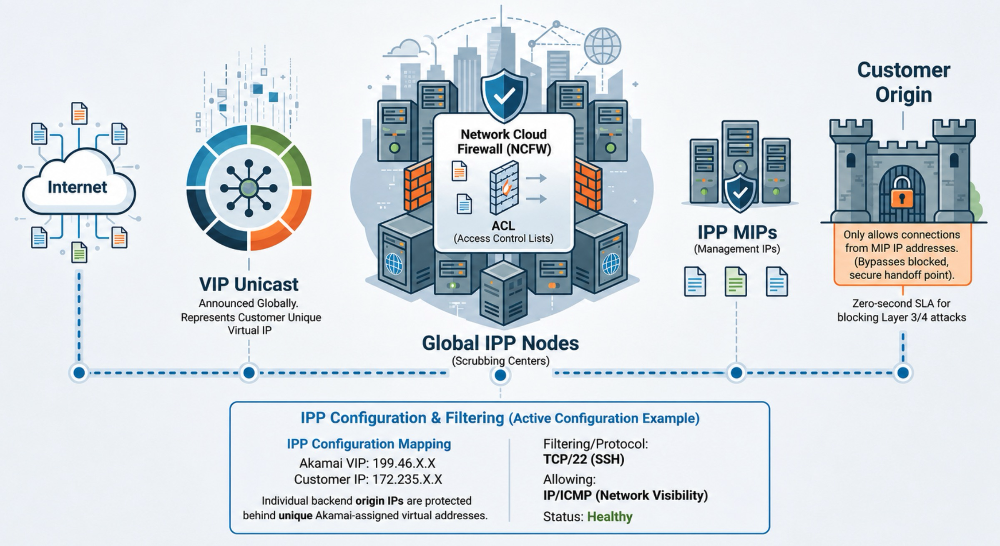

# IPP Jupyter Demo

This repository contains a Jupyter Notebook that demonstrates a basic Akamai Prolexic IP Protect workflow using the IP Protect Configuration API and EdgeGrid authentication.



The demo notebook covers:

- creating an authenticated EdgeGrid session
- selecting an IPP policy domain
- allocating a new IPv4 VIP
- creating a VIP-to-origin mapping
- cleaning up the demo VIP mapping again

## Requirements

- macOS, Linux, or Windows
- Python 3.14 or later
- an Akamai API client with IP Protect Configuration API permissions
- an `.edgerc` file in your home directory
- `uv` for dependency management and launching Jupyter

## Install uv

Choose one of the following installation methods.

### macOS

Using Homebrew:

```bash
brew install uv
```

Using the official installer:

```bash
curl -LsSf https://astral.sh/uv/install.sh | sh
```

### Linux

Using the official installer:

```bash
curl -LsSf https://astral.sh/uv/install.sh | sh
```

### Windows

Using PowerShell:

```powershell
powershell -ExecutionPolicy ByPass -c "irm https://astral.sh/uv/install.ps1 | iex"
```

After installation, verify it:

```bash
uv --version
```

## Project Setup

Install the project dependencies:

```bash
uv sync
```

If you need to add packages later:

```bash
uv add <package-name>
```

This project currently uses:

- `edgegrid-python`
- `jupyter`

## Akamai Credentials

The notebook reads credentials from `~/.edgerc`.

Example:

```ini
[default]
host = your-host.luna.akamaiapis.net
client_token = your-client-token
client_secret = your-client-secret
access_token = your-access-token
```

You can optionally select a non-default section:

```bash
export AKAMAI_EDGEGRID_SECTION="gss"
```

If you manage multiple Akamai accounts, you can also set:

```bash
export AKAMAI_ACCOUNT_SWITCH_KEY="your-account-switch-key"
```

If you already know which policy domain to use, you can pin it explicitly:

```bash
export AKAMAI_IPP_POLICY_DOMAIN="example_ipp"
```

If `AKAMAI_IPP_POLICY_DOMAIN` is not set, the notebook looks up available policy domains and uses the first name containing `_ipp`.

## Run The Notebook

Start Jupyter with uv:

```bash
uv run jupyter lab ipp-demo.ipynb
```

Run the notebook cells in order.

## Notebook Flow

The notebook performs the following steps:

1. Create a requests session authenticated with EdgeGrid.
2. Resolve the target policy domain.
3. Allocate one IPv4 VIP (the response includes the updated configuration).
4. Create a demo passthrough mapping to `172.235.183.154/32`.
5. Track the exact created VIP.
6. Remove only that tracked VIP during cleanup (fetches the latest configuration first).

## Safety Notes

- The cleanup step is designed to remove only the VIP created by the notebook.
- The cleanup logic relies on the tracked `vipId` from the create step.
- If you restart the kernel, rerun the notebook cells in order before running cleanup.

## Troubleshooting

If `uv sync` fails:

- verify that `uv` is installed and on your `PATH`
- verify that your Python version is compatible with `pyproject.toml`

If Akamai API requests fail:

- verify the `~/.edgerc` location and values
- verify the selected `AKAMAI_EDGEGRID_SECTION`
- verify your API client has IP Protect Configuration API permissions
- verify `AKAMAI_ACCOUNT_SWITCH_KEY` if you are switching accounts

## Reference

- Akamai IP Protect Configuration API documentation: https://techdocs.akamai.com/ip-protect/reference/api
- uv documentation: https://docs.astral.sh/uv/
